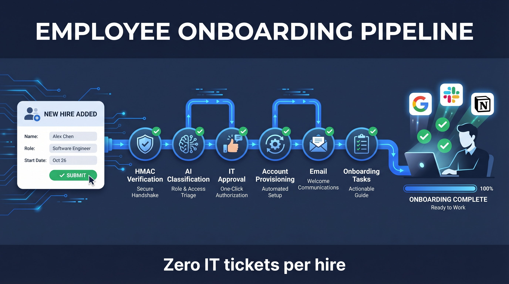
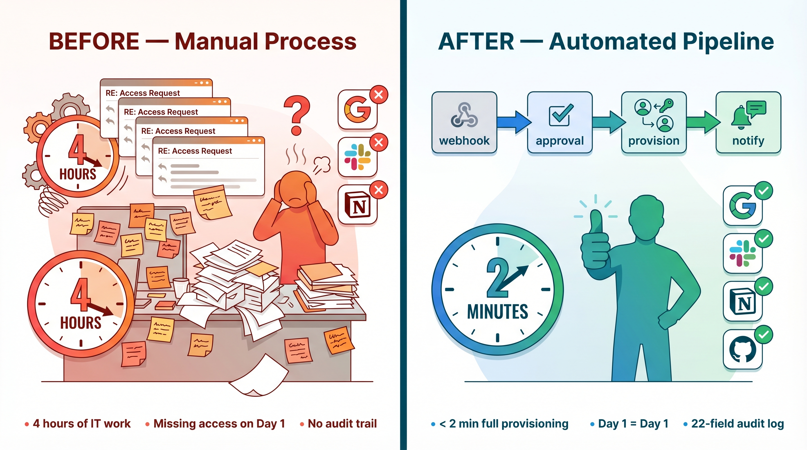
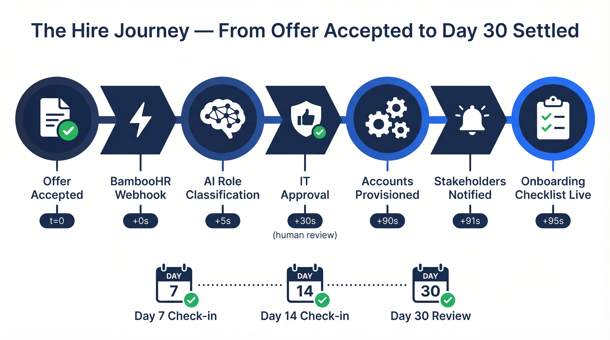
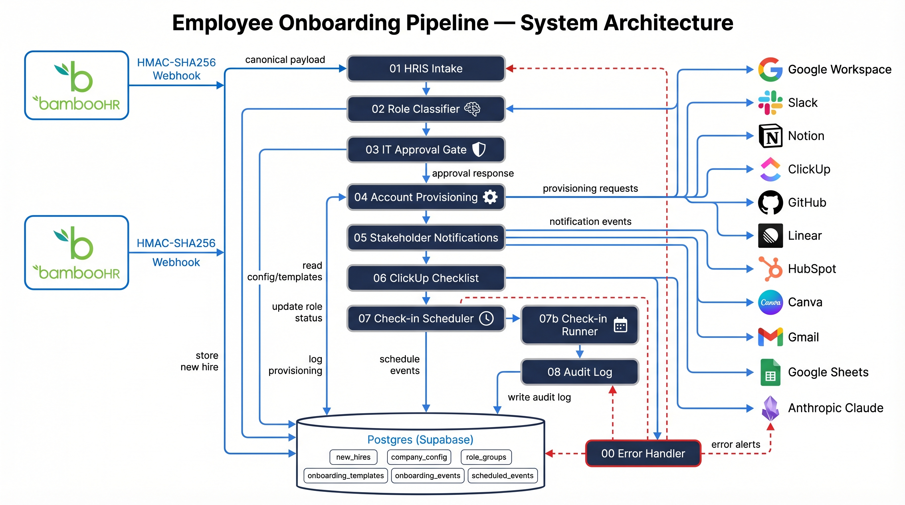
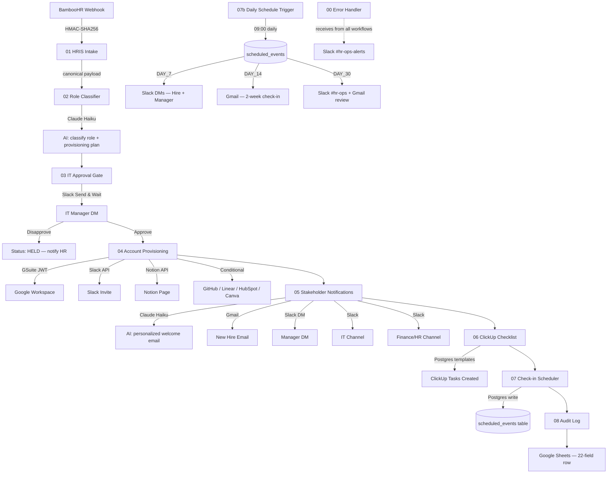
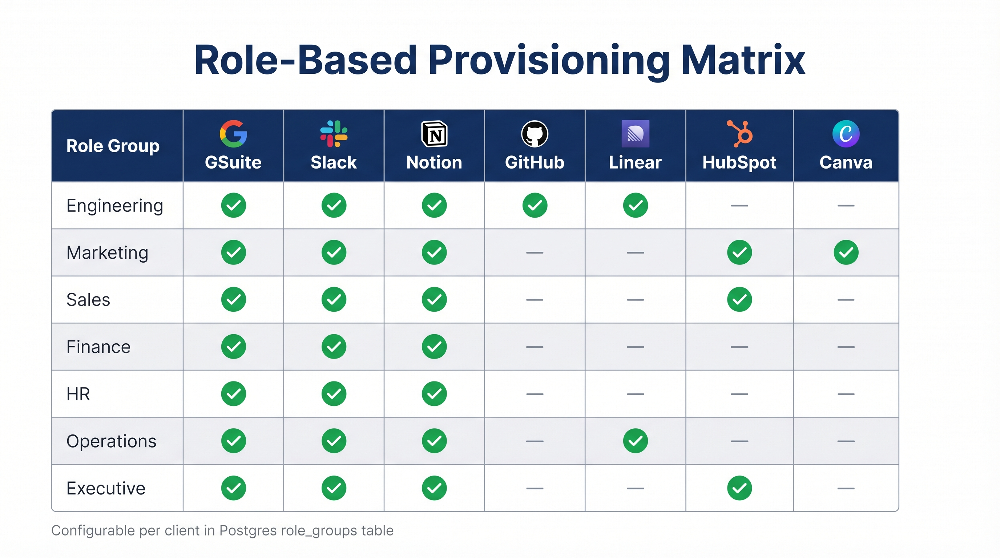
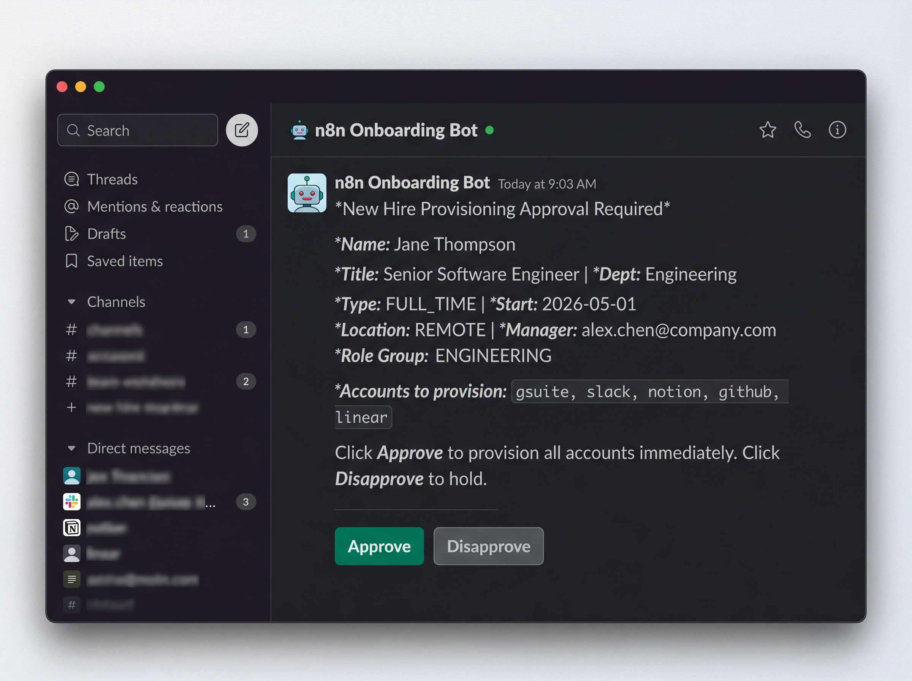
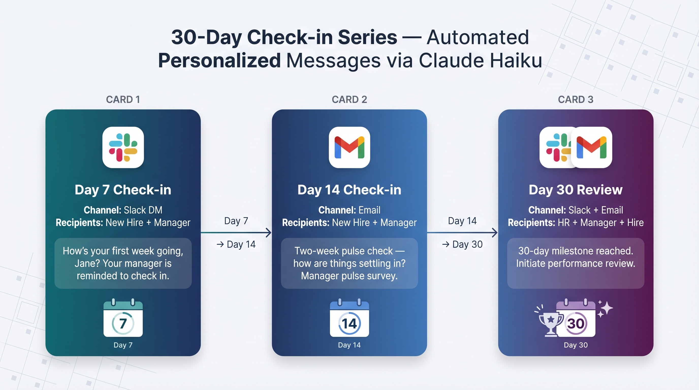
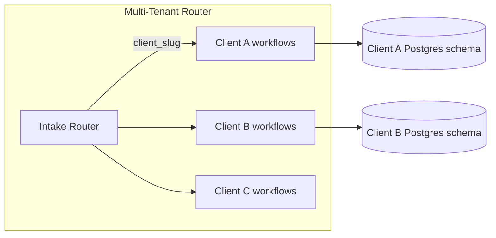

<div align="center">



# Employee Onboarding Pipeline

**10-workflow n8n automation: BambooHR → AI role classification → IT approval gate → GSuite + Slack + Notion provisioning → ClickUp onboarding checklist → 30-day check-in series.**

[](https://n8n.io)
[](https://anthropic.com)
[](https://supabase.com)
[]()

> *The gap between "offer accepted" and "employee fully onboarded" is where enterprises waste the most time. This pipeline closes it — automatically.*

</div>

---

## At a Glance

| Metric | Value |
|---|---|
| Time: webhook received → all accounts provisioned | **< 2 minutes** |
| IT admin hours eliminated per hire | **~4 hours** |
| Stakeholders notified in one trigger | **4** (hire, manager, IT, finance/HR) |
| Automated check-ins per hire | **3** (day 7, 14, 30) |
| Manual onboarding steps automated | **23+** |
| Duplicate hire processing | **0** (Postgres idempotency) |
| Missed provisioning events | **0** (IT gate enforced before any account created) |
| AI cost per hire | **~$0.003** (Claude Haiku) |

---

## For Non-Technical Readers

If you manage HR, run a team, or are evaluating this for your organization — this section is for you.

**What this does, in plain English:**

When a new employee is added to your HR system (BambooHR), this pipeline automatically:

1. **Verifies the request is legitimate** — cryptographic signature check, not just a password
2. **Figures out what tools they need** — using AI to read their job title and department
3. **Asks IT to approve** — a Slack message goes directly to your IT manager; nothing is provisioned until they click Approve
4. **Creates all accounts simultaneously** — Google Workspace email, Slack invite, Notion onboarding page, and role-specific tools (GitHub, Linear, HubSpot, Canva)
5. **Notifies everyone who needs to know** — personalized welcome email to the hire, alert to their manager, summary to IT, headcount notice to Finance and HR
6. **Creates the onboarding task list** — a ClickUp checklist with the right tasks, the right assignees, and the right due dates for their specific role
7. **Follows up automatically** — Day 7, Day 14, and Day 30 check-in messages to the hire and their manager, personalized by AI

**The result:** A new hire goes from "offer accepted" to fully provisioned and onboarded — with no IT tickets, no Slack threads asking for access, no spreadsheet tracking.

---

## Before & After



| Before (Manual) | After (This Pipeline) |
|---|---|
| IT manually creates accounts (2–4 hours per hire) | All accounts created in < 2 minutes |
| HR emails IT with a list of tools needed | AI classifies role + provisioning plan automatically |
| No formal approval process — accounts created on request | IT approval gate enforced before any provisioning |
| New hire arrives with missing access | All accounts live on or before start date |
| Manager learns about new hire through the grapevine | Slack DM to manager on day of provisioning |
| 30-day check-ins forgotten | Day 7, 14, 30 check-ins scheduled and sent automatically |
| Audit trail: none | Dual-layer: Postgres event log + Google Sheets row per hire |

---

## Business Impact

- **$0 per hire in IT labor** for account creation (vs. ~4 hours @ $75/hr = $300/hire at 50 hires/year = $15,000/year)
- **Same-day provisioning** — no hire arrives to find their laptop works but they can't log in
- **Documented approval trail** — every account creation has a named IT approver and timestamp
- **Compliance-ready audit log** — 22 fields per hire, immutable, queryable

---

## The Problem

Enterprise onboarding is broken in a specific way: it's not that companies don't care about new hires — it's that the handoff from HR to IT to the hiring manager involves email threads, Slack messages, and tribal knowledge. Someone forgets to add the new engineer to GitHub. The Notion onboarding page doesn't get created. The 30-day check-in never happens because everyone is busy.

This pipeline removes the humans from the mechanical parts so the humans can focus on the meaningful parts.



---

## System Architecture





---

## Workflow Structure

| # | Workflow | Trigger | Key Action |
|---|---|---|---|
| 00 | Error Handler | n8n Error Trigger | Classifies severity, posts structured Slack alert with hire context |
| 01 | HRIS Intake | BambooHR Webhook | HMAC verify → normalize payload → idempotency check → chain to 02 |
| 02 | Role Classifier | Sub-workflow | Claude Haiku classification + Postgres fallback → load provisioning plan |
| 03 | IT Approval Gate | Sub-workflow | Slack Send & Wait → Disapprove (notifies HR) or Approve (chains to 04) |
| 04 | Account Provisioning | Sub-workflow | GSuite + Slack + Notion + conditional tools, per-service isolation |
| 05 | Stakeholder Notifications | Sub-workflow | Claude welcome email + 4-channel parallel notification |
| 06 | ClickUp Checklist | Sub-workflow | Postgres templates → role-specific task list with due dates |
| 07 | Check-in Scheduler | Sub-workflow | Writes DAY_7/14/30 rows to `scheduled_events` → chains to audit |
| 07b | Check-in Runner | Daily 09:00 Schedule | Polls Postgres → Claude-personalized Slack/Gmail check-ins |
| 08 | Audit Log | Sub-workflow | Appends 22-field row to Google Sheets (RAW mode) |

---

## AI Layer

Three Claude Haiku calls per hire lifecycle. ~$0.003 total.

| Call | Workflow | Input | Output |
|---|---|---|---|
| Role Classification | 02 | job_title + department | role_group, confidence, provisioning_hints, welcome_tone |
| Welcome Email | 05 | hire context + provisioned tools + welcome_tone | Personalized subject + body |
| Check-in Messages | 07b | hire context + day number | Short personalized message (×3 events) |

All inputs wrapped in `---BEGIN/END HIRE DATA---` delimiters with system prompt directive to treat content as plain text — prompt injection defense.

If Claude confidence is < 0.8 on role classification, the pipeline falls back to Postgres keyword matching on the `role_groups.keywords` array. Zero dependency on AI availability for correctness.

---

## Role-Based Provisioning Matrix



| Role Group | GSuite | Slack | Notion | GitHub | Linear | HubSpot | Canva |
|---|:---:|:---:|:---:|:---:|:---:|:---:|:---:|
| ENGINEERING | ✅ | ✅ | ✅ | ✅ | ✅ | — | — |
| MARKETING | ✅ | ✅ | ✅ | — | — | ✅ | ✅ |
| SALES | ✅ | ✅ | ✅ | — | — | ✅ | — |
| FINANCE | ✅ | ✅ | ✅ | — | — | — | — |
| HR | ✅ | ✅ | ✅ | — | — | — | — |
| OPERATIONS | ✅ | ✅ | ✅ | — | ✅ | — | — |
| EXECUTIVE | ✅ | ✅ | ✅ | — | — | ✅ | — |

_Matrix is configured per client in Postgres `role_groups` table — not hardcoded in workflow logic._

---

## IT Approval Gate



When a new hire is detected, a Slack message is sent **directly to the IT manager's DM** (not a channel — avoiding diffusion of responsibility). The message shows: full name, job title, department, start date, location, employment type, manager, and the exact list of accounts to be provisioned.

The IT manager has one click: **Approve** or **Disapprove**. These are Slack's native Send-and-Wait button labels — fixed by the platform.

- **Approve** — pipeline continues immediately, all accounts provisioned
- **Disapprove** — HR is notified with the reason, execution ends, no accounts are created

This is a hard gate. There is no code path that creates accounts without an approval. If the start date shifts or the hire rescinds, one click prevents a cleanup incident.

---

## 30-Day Check-in Series



| Day | Channel | Recipient | Content |
|---|---|---|---|
| Day 7 | Slack DM | New hire + Manager | Claude-personalized "first week check-in" + manager reminder |
| Day 14 | Gmail | New hire + Manager | 2-week check-in email + manager pulse survey prompt |
| Day 30 | Slack (#hr-ops) + Gmail | HR + Manager + Hire | "Day 30 reached — initiate review?" alert + review initiation email |

**Why Postgres + daily runner, not n8n Wait node:**
Wait nodes suspend execution for the full delay period — consuming cloud resources, failing on restarts, and creating timeout risk with 100+ concurrent hires. Writing timestamps to `scheduled_events` and polling daily costs nothing while waiting, survives any restart, and handles unlimited concurrent hires.

---

## Security Architecture

| Layer | Implementation |
|---|---|
| BambooHR webhook auth | HMAC-SHA256 on raw body, timing-safe comparison |
| Raw body preservation | `rawBody: true` on webhook node — HMAC computed before JSON parsing |
| Replay protection | `eventTime` rejected if > 10 minutes old |
| Idempotency | `UNIQUE` on `new_hires.hire_id` + pre-flight SELECT |
| Credential storage | n8n encrypted credential store only — never in workflow JSON or git |
| HMAC secrets | n8n environment variables — never in Code node source |
| Sub-workflow access | `callerPolicy: workflowsFromSameOwner` on all 8 sub-workflows |
| PII retention | `saveDataSuccessExecution: none` — no PII in n8n execution logs |
| Provisioning gate | IT approval required — no code path bypasses it |
| Per-service isolation | Each provider in its own try/catch — one failure can't cascade |
| Formula injection | Google Sheets: `valueInputOption: RAW` |
| Prompt injection | Hire data wrapped in `---BEGIN/END---` delimiters + system directive |
| GSuite scope | `admin.directory.user` only — no other Admin SDK scopes granted |
| SQL injection | Parameterized queries ($1, $2) exclusively — no string interpolation |
| Audit trail | Postgres events (queryable) + Google Sheets (human-readable) — both append-only |

---

## Engineering Decisions

**Why HRIS-agnostic canonical schema**
HRIS vendor migrations happen every 2–3 years. If downstream workflows read BambooHR field names directly, every migration requires touching 8 workflows. With a canonical schema, a client swapping HRISes writes one new adapter workflow — zero changes to 02–08.

**Why Claude AI + Postgres fallback for role classification**
Job titles are ambiguous. "Growth Lead" could be Marketing or Sales. "Head of People" is HR but the title doesn't say that. Claude handles the edge cases. When confidence is < 0.8, Postgres keyword matching provides a deterministic result with no AI dependency. The system is correct with or without AI availability.

**Why IT approval gate before provisioning**
Start dates shift. Hires rescind. Accounts provisioned for a no-show create cleanup work and a security incident. Regulated industries require documented pre-access approval. One Slack message is all it takes to prevent an account that never needed to exist.

**Why per-service provisioning isolation**
Notion API outages are independent of GSuite API outages. If the whole provisioning step fails because one service is down, the hire arrives with no accounts. With per-service isolation, a Notion outage means one missing onboarding page — not a failed hire with no email account.

**Why Postgres `scheduled_events` instead of n8n Wait node**
Wait nodes suspend execution for the full period — 7 to 30 days — consuming cloud instance memory and failing silently on server restarts. The table + daily runner pattern: costs nothing while waiting, survives any infrastructure event, handles 100+ concurrent hires, and gives ops a queryable view of all pending check-ins.

**Why GSuite Service Account, not OAuth2**
OAuth2 creates/manages the authenticated user's own account. Creating accounts for *other* users requires domain-wide delegation, which is a Service Account capability only. There is no way to create new users with OAuth2.

**Why `$execution.customData` at every stage**
n8n's error handler receives the execution ID but no payload context. Without customData, a failure alert says "workflow 04 failed" — and you spend 10 minutes hunting the logs to find out which hire was affected. With customData, the alert says "Jane Test (hire_id: 12345) failed in account-provisioning."

**Why timing-safe HMAC comparison**
Naive string equality (`===`) leaks information through timing: a response that returns slightly faster when the first byte mismatches vs. when all bytes match allows an attacker to brute-force the secret byte-by-byte. `crypto.timingSafeEqual` eliminates this attack surface by running in constant time regardless of byte position. Note: n8n's `rawBody` is best-effort — the implementation falls back through 3 access paths (`$input.first().binary`, `$request.rawBody`, and `JSON.stringify($json.body)`) to handle cases where the webhook node does not populate `rawBody` before JSON parsing.

**Why dual-layer audit**
Postgres `onboarding_events` is queryable with SQL — ops can answer "show me all failed provisioning events in the last 30 days" in seconds. Google Sheets is human-readable without database access — HR can open a spreadsheet. Both are written on every action. A Sheets API outage doesn't lose the Postgres record and vice versa.

---

## Audit Log — 22 Fields

Every provisioning run writes one row to Google Sheets:

`hire_id` · `full_name` · `personal_email` · `job_title` · `department` · `role_group` · `employment_type` · `start_date` · `manager_email` · `source_system` · `it_approved_by` · `it_approved_at` · `gsuite_status` · `slack_status` · `notion_status` · `additional_tools_status` · `welcome_email_sent` · `manager_notified` · `clickup_checklist_created` · `check_ins_scheduled` · `pipeline_started_at` · `pipeline_completed_at`

---

## Tech Stack

| Layer | Technology | Version |
|---|---|---|
| Workflow automation | n8n Cloud | 1.50+ (hosted) |
| HRIS source | BambooHR | webhook + HMAC-SHA256 |
| AI / LLM | Anthropic Claude Haiku 4.5 | — |
| Work email | Google Admin SDK (Service Account) | — |
| Team communication | Slack API (Bot Token) | node v2.4 |
| Knowledge management | Notion API | — |
| Project management | ClickUp API | — |
| Email delivery | Gmail OAuth2 | node v2.2 |
| Audit log | Google Sheets (OAuth2, RAW mode) | node v4.7 |
| Database | Postgres via Supabase (6 tables) | node v2.6 |
| HTTP requests | httpRequest node | v4.4 |
| Webhook intake | Webhook node | v2.1 |
| Language | JavaScript (Code nodes) | — |

---

## Production Metrics

| Signal | Target |
|---|---|
| Webhook → provisioned (p99) | < 120 seconds |
| IT approval response (typical) | < 15 minutes |
| Claude role classification latency | < 3 seconds |
| Postgres query time (idempotency check) | < 50ms |
| Daily check-in runner duration (100 hires) | < 30 seconds |
| Error handler alert delivery | < 10 seconds after failure |

---

## Who Uses This

**HR Director at a 50–500 person company** — You've been doing onboarding with a shared Google Sheet and a Slack thread. Every hire is a scramble. This pipeline eliminates the scramble.

**IT Manager at a SaaS company** — You're tired of getting Slack messages asking for tool access. This puts you in control: one approval button, full audit trail, no manual provisioning.

**CEO at a growth-stage startup** — You're hiring fast. Each new person who arrives to missing access is a first-day experience failure. This makes sure Day 1 is Day 1.

**Head of People Operations** — You need evidence that your processes are running. This gives you a 22-field audit row per hire, check-in tracking, and a provisioning matrix you can show to your board.

**Systems Integrator / MSP** — You deliver HR automation to enterprise clients. This is a showcase of what enterprise-grade n8n implementation looks like — security, auditability, HRIS-agnostic design.

---

## Phase 2: Enterprise Architecture

The current pipeline is single-tenant. Phase 2 adds:



- **Multi-HRIS support** — Rippling adapter (01b), Workday adapter (01c), Generic webhook (01d)
- **Multi-tenant credential isolation** — per-client credential sets, client_slug routing
- **Webhook signature verification per HRIS type** — BambooHR HMAC, Rippling JWT, Workday OAuth
- **Offboarding workflow** — reverse provisioning on termination event
- **Manager self-service portal** — approve/modify provisioning plan before IT gate

---

## Lessons Learned

**BambooHR webhook field names vary per company configuration.** The normalization Code node in Workflow 01 maps multiple field name variants (`firstName` vs `first_name` vs `preferredName`). Always verify against the client's actual webhook payload before go-live.

**n8n Wait nodes are not production-safe for long durations.** We discovered this building an earlier iteration with 30-day waits. The Postgres + daily runner architecture in Workflow 07b is the correct pattern.

**The IT approval gate is also the sales conversation.** Every enterprise buyer who sees the Slack approval card mockup immediately understands the business case — one button, full accountability, no manual tickets.

**Confidence thresholds for AI classification need calibration.** The 0.8 threshold works well for clear-cut roles. For companies with unusual job titles (common at startups), the threshold may need to drop to 0.7 or the Postgres keyword matching needs richer entries.

**n8n Code nodes natively support `fetch()` + async/await — external HTTP calls work without the `$helpers` utility.** Per-service try/catch inside one Code node is cleaner than multiple HTTP Request nodes with complex merge graphs.

---

## Setup & Repository

See [SETUP.md](./SETUP.md) for complete implementation instructions including SQL DDL, credential setup, and activation order.

```
workflows/
├── 00-error-handler.json
├── 01-hris-intake-bamboohr.json
├── 02-role-classifier.json
├── 03-it-approval-gate.json
├── 04-account-provisioning.json
├── 05-stakeholder-notifications.json
├── 06-clickup-checklist.json
├── 07-checkin-scheduler.json
├── 07b-checkin-runner.json
└── 08-audit-log.json
```

See [replacements.txt](./replacements.txt) for the full list of credential placeholders.

---

<div align="center">

**Built by Rex Quintenta**

Available for enterprise onboarding automation implementations. Pair this with [recruitment-pipeline](https://github.com/RexOwenDev/recruitment-pipeline) for a complete "sourced to settled" HR automation story.

[Get in touch](mailto:rexowendev@gmail.com) · [View recruitment-pipeline →](https://github.com/RexOwenDev/recruitment-pipeline)

</div>
