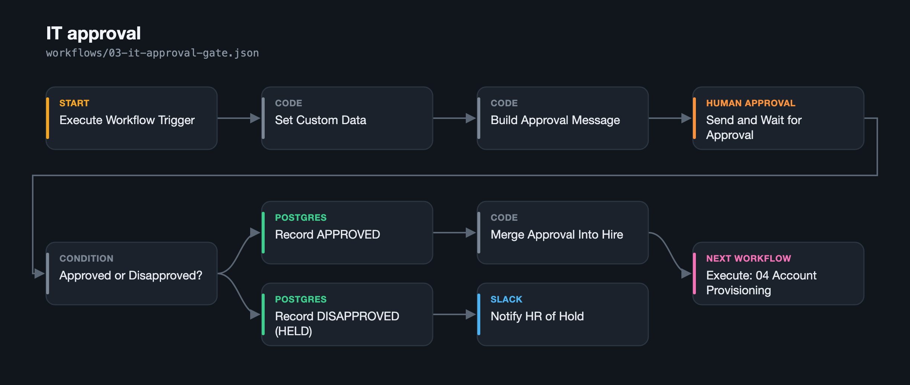
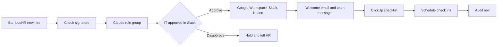
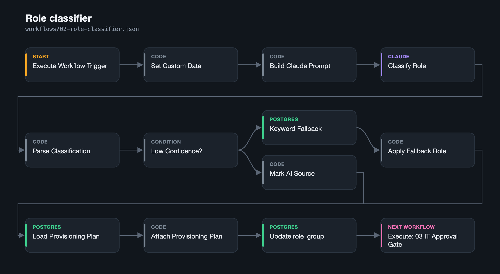

# Employee Onboarding Pipeline

When a new hire is added in BambooHR, this pipeline asks IT for approval in Slack, creates the hire's Google Workspace, Slack and Notion access, welcomes them and builds their onboarding checklist.

**Built for** HR and IT teams at growing companies that use BambooHR, Google Workspace and Slack and want every new hire set up the same way, with a record of who approved it.

**What is in this repo:** ten n8n workflows, a setup guide with the database tables and a placeholder map. Import them into your own n8n and connect your accounts.

## What happens for each new hire

1. **Receive.** BambooHR sends the new hire. The intake workflow checks the signature in constant time, rejects requests with a missing timestamp or one older than ten minutes, and skips hires it has already processed.
2. **Classify.** Claude Haiku reads the job title and department and picks a role group. If its confidence is below 0.8, keyword rules stored in Postgres decide instead. The role group sets which tools the hire gets.
3. **Approve.** The IT manager gets a Slack message with the hire's details and the accounts to create. Nothing is created until they click **Approve**. **Disapprove** puts the hire on hold and tells HR.
4. **Provision.** The pipeline creates the Google Workspace user, sends the Slack invite and creates the Notion onboarding page. Each service runs on its own, so one failure does not stop the others.
5. **Notify.** Claude writes a welcome email that goes to the hire through Gmail. The manager, the IT channel and the finance and HR channel get Slack messages.
6. **Checklist.** A ClickUp folder, list and tasks are created from templates stored in Postgres for that role group.
7. **Follow up.** Check ins for days 7, 14 and 30 are saved in Postgres, and a daily 09:00 run sends the ones that are due.
8. **Record.** Every step writes an event to Postgres, and the run ends with a 22 field row in Google Sheets.

```mermaid
flowchart LR
    A[BambooHR new hire] --> B[Check signature]
    B --> C[Claude role group]
    C --> D{IT approves in Slack}
    D -->|Approve| E[Google Workspace, Slack, Notion]
    D -->|Disapprove| F[Hold and tell HR]
    E --> G[Welcome email and team messages]
    G --> H[ClickUp checklist]
    H --> I[Schedule check ins]
    I --> J[Audit row]
```

## Workflows

| File | Starts when | What it does |
| --- | --- | --- |
| `00-error-handler.json` | Any workflow fails | Records the failure in Postgres and alerts Slack with the hire's details |
| `01-hris-intake-bamboohr.json` | BambooHR sends a hire | Checks the signature and timestamp, skips duplicates, saves the hire |
| `02-role-classifier.json` | Called by 01 | Picks the role group with Claude or keyword rules and loads the tool plan |
| `03-it-approval-gate.json` | Called by 02 | Waits for the IT manager's decision in Slack |
| `04-account-provisioning.json` | Called by 03 | Creates Google Workspace, Slack and Notion access |
| `05-stakeholder-notifications.json` | Called by 04 | Sends the welcome email and the Slack messages |
| `06-clickup-checklist.json` | Called by 05 | Builds the ClickUp folder, list and tasks |
| `07-checkin-scheduler.json` | Called by 06 | Saves the day 7, 14 and 30 check ins |
| `07b-checkin-runner.json` | Every day at 09:00 | Sends the check ins that are due |
| `08-audit-log.json` | Called by 07 | Adds the 22 field audit row |

## Security

* The BambooHR webhook requires a valid HMAC SHA256 signature and a fresh timestamp.
* Nothing is provisioned without a named approval from IT.
* Every database query uses parameters. No values are pasted into SQL.
* Successful runs do not keep execution data, so personal details do not sit in n8n history.
* Sub workflows accept calls only from workflows owned by the same n8n account.
* Hire details sent to Claude are wrapped in markers and treated as plain text.
* Google Sheets writes use raw mode, so hire data cannot turn into a formula.

## Set up

Follow [SETUP.md](SETUP.md) for the six database tables, credentials, import order and activation. [replacements.txt](replacements.txt) lists every placeholder.

## Current limits

* GitHub, Linear, HubSpot and Canva accounts are planned. Their steps are placeholders that stop with a clear message.
* Slack invites use an admin endpoint that works on Enterprise Grid and legacy admin plans. Enterprise Grid workspaces can switch to SCIM instead.
* Day 7 messages are sent in Slack. The day 14 and day 30 emails are placeholders that write a log line instead of sending.

Built by Rex Owen Quintenta · [Email](mailto:owenquintenta@gmail.com) · [LinkedIn](https://linkedin.com/in/owendev) · [Upwork](https://www.upwork.com/freelancers/~016d94e91b51fc9dec)
